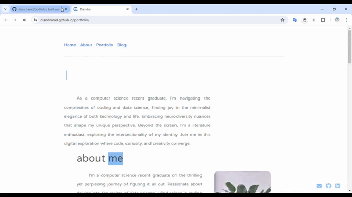

# Personal Website

## Overview
This website showcases my portfolio, blog, and other information. The project is built using HTML, CSS, and JavaScript, and utilizes the Bootstrap framework for styling. It showcases my portfolio, and blog, and provides information about my background and interests.

## Features
- **Navigation**: Users can navigate through different sections of the website using the navigation bar.
- **Home**: Provides a brief introduction about me, and my interests journey.
- **About**: Offers more detailed information about my background, skills, and interests.
- **Portfolio**: Showcases a collection of my projects, including descriptions and links to demo videos, GitHub repositories, and live websites where applicable.
- **Blog**: Contains blog posts written by me, sharing my thoughts, experiences, and progress updates on various topics.
- **Responsive Design**: The website is designed to be responsive, ensuring a consistent user experience across different devices.

## Contact
For any inquiries or feedback, you can reach out to me via email at [diandraregita14@gmail.com](mailto:diandraregita14@gmail.com) or connect with me on [GitHub](https://github.com/diandrarad) and [LinkedIn](http://linkedin.com/in/diandradamanik).
